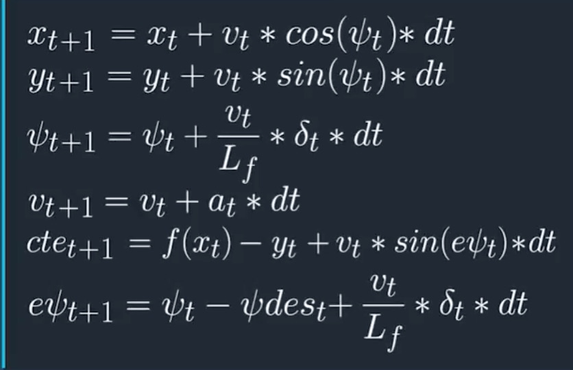

# MPC Writeup
**Author:** Evan Loshin

**Final Video Submission:** https://youtu.be/da-GK2Cn-TU

[](http://www.udacity.com/drive)

### The Model

This implementation of model predictive control (MPC) makes steering and throttle decisions based on data about a car's motion relative to the road's center. My code relies on data about the vehicle's current state, as well as a set of equations that describe the simulated vehicle's unique kinetics.

These variables are used to describe the vehicle's current state.
- **x** - Horizontal map position
- **y** - Vertical map position
- **psi** - Heading
- **v** - Velocity

The equations below predict the vehicles motion over a timestep *dt*. *Lf* is the length between the front of the vehicle and it's center of gravity. *cte* and *epsi* are error measurements between the vehicle and its current waypoint. Their values are derived from the state variables and waypoint coordinates passed to [main.cpp](./src/main.cpp) from the simulator.

> 
*Source: Udacity CarND 2.19.6*

The state variables, vehicle model, and actuator limitations are passed to a C++ optimizer (*iPopt*) that approximates the next steering angle and throttle actuations subject to a set of weighted cost constraints summarized below.

```cpp
// Minimize distance from waypoints.
cost += cte_weight * pow(cte, 2);
cost += epsi_weight * pow(epsi, 2);
cost += v_weight * pow(v - target_v, 2);

// Minimize the use of actuators.
cost += delta_weight * pow(delta, 2);
cost += a_weight * pow(a, 2);

// Minimize the value gap between sequential actuations.
cost += delta_jerk_weight * pow(delta_next - delta, 2);
cost += a_jerk_weight * pow(a_next - a, 2);
```

### Timestep Details

I tested my model by passing the optimizer a prediction horizon of 1 second and *dt* of 100 milliseconds. I landed on these values because it's admittedly what the project walk-through video used.

These choices seemed reasonable given my reference velocity of 45 MPH, which converts to ~20 m/s. Intuitively, a single constant actuation command over a 20 meter distance seems reasonable. The computational load was manageable within the 0.5 seconds allotted to the optimizer given the positive simulation results.

### Preprocessing Details

Preprocessing steps were taken to convert the map waypoints to the vehicle's orientation. Then, the code fits a 3rd degree polynomial to the waypoints. This way, the polynomial can be compares to the vehicle's orientation to calculate *cte* and *epsi* values.

### Latency Management

I implement an additional preprocessing step to deal with the simulated impact of latency in the vehicle's response to actuation commands. To deal with this delay, I advance the vehicle's current state proportional to the length of delay before executing MPC. This allows the model to preemptively calculate appropriate actuations for a future time when those commands will be executed.

In order to calculate the new latent state, I apply the kinematic vehicle model equations to the current state for the length of the delay. This method requires querying the vehicle's acceleration and steering angle. However, the simulator isn't configured to report acceleration. I use "throttle" instead to approximate acceleration. I used a conversion factor derived by Slack user *Alexs555* of 1 throttle unit to 5 m/s^2.

Here is to code to derive the vehicle's latent state. `conversion_factor` converts the velocity from miles per hour to meters per second.
```cpp
// Advance the vehicle's state for the amount of latency.
px = px + v * conversion_factor * cos(psi) * latency;
py = py + v * conversion_factor * sin(psi) * latency;
psi = psi + v * conversion_factor / Lf * delta * latency;
v = v + acceleration * 5 * latency * (3600/1609);
```
